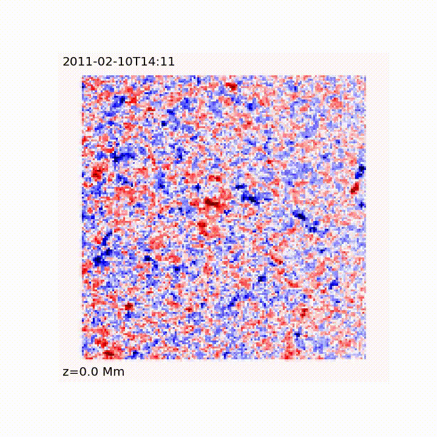

Author: @markcheung and @kirklong

**Note:** I (Kirk) have edited / added commentary to this document as I have gone through installing the code -- I have never done anything Solar before so if you are a novice like me hopefully my edits can help you make it through the instructions faster than I did! I have also written a new [instruction manual](DEPENDENCIES.md) related entirely to installing the dependencies (step 0) for the project, so if you get stuck there / have never done something like that before hopefully that will be a good guide for you.

Module for the D1 Deliverable of the Coronal Global Evolutionary Model
([Fisher et al., 2015](https://agupubs.onlinelibrary.wiley.com/doi/full/10.1002/2015SW001191))<br>

Deliverable D1 is the spherical wedge magnetofriction (MF) model driven by electric fields
hosted at JSOC.

**Step 0**: Configure Makefile for MF code, install dependent packages.<br>
The base directory for this package is Deliverables_D1_Template/. <br>
Edit the following lines in Deliverables_D1_Template/MF/Makefile<br>

| Makefile variable | Default | Package available at |
| ------ | ------ | ------ |
| FFTW | $HOME/opt/fftw-3.3.7 | [Download FFTW](http://www.fftw.org/download.html) |
| FISHPACK | $HOME/opt/fishpack4.1 | [Download FISHPACK 4.1](https://www2.cisl.ucar.edu/resources/legacy/fishpack) |
| SDF | $HOME/opt/sdf | [Download SDF](http://solarmuri.ssl.berkeley.edu/~fisher/public/software/SDF/) |

FFTW should be compiled with Fortran and OpenMP enabled.

**Compiler flags for fishpack (need to be 64-bit reals):**
gfortran:`-fdefault-real-8`
ifort:`-fp-model strict -r8`

In addition to the packages listed above, you will need Intel compilers (check with `which ifort` and `which mpiifort`), IDL (`which idl`), and SolarSoft (`sswidl`) installed. For help / detailed instructions on how to install all dependencies, see [the dependencies document](DEPENDENCIES.md). Make sure all of these packages are installed and precompiled on your system before proceeding.

Note that many of the scripts require the csh shell, not bash (which is probably what you're using by default) -- you can start a csh (or tcsh) session simply by typing `csh` / `tcsh` into the command prompt (type `exit` when done to go back to bash). If you don't have csh for some reason (or tcsh, which is probably better?) install it with your package manager (ie `sudo apt-get install tcsh`).

**Step 1**: request.params stores the four user input parameters specific to each run:<br>
NOAA AR num <br>
start time - start time of the model <br>
end time - end time of the model <br>
binning factor - how many pixels to rebin from the original electric field series (to lower the number of grid points in the MF model) <br>
email - email for JSOC to notify user of data request status. Change this to your registered email, and if you haven't used JSOC before you can register your email [here](http://jsoc.stanford.edu/ajax/register_email.html).

For example, the sample file looks like this:<br>
`% more request.params ` <br>
 12673 <br>
2017-09-02T00:10:42.50Z <br>
2017-09-06T23:00:00.00Z <br>
4 <br>
user@gmail.com <br>
This tells the workflow downstream to fetch precomputed electric field
data from JSOC for NOAA AR 12673 for this time range. The factor 4 tells
it to downsize (in terms of number of grid cells) by 4 from the original
E-field data pixel size.

**Step 2**: cgem_fetch.pro (in IDL subdirectory) fetches electric fields from JSOC: <br>
In SolarSoft (ie run `sswidl`), <br>
`IDL>.r cgem_fetch`<br>
This will fetch the electric and magnetic field data from JSOC for the region defined in request.params. Make sure you have configured this with a registered email address (see step 1). This takes a hot second to run (like >1 hour, at least with default request.params file).

**Step 3**: cgem_ic.pro fetches electric fields from JSOC: <br>
In SolarSoft, in the same IDL session as previous,  <br>
`IDL>.r cgem_ic`<br>
This will generate the mesh, the boundary condition files and dump them in two directories, initrun and evolverun.

**Step 4**: run shell script <br>
`%./copy_startup.csh`<br>
This will copy relevant files into the initrun and evolverun directories.
It will also run the compiler to make executables, copy into these directories.

Suppose the computational grid has [Nx, Ny, Nz] cells ([Nx+1, Ny+1, Nz+1] grid corners). The number of grid corners are available from the mesh.readme file, which is generated by cgem_ic.pro. Suppose we wish to decompose the computational domain into [cx, cy, cz] subdomains. The following requirements must be satisfied for the code the run.<br>
1) It’s important that Nx (Ny, Nz) be divisible by cx (cy, cz) etc., and<br>
2) the number of procs = cx`*`cy`*`cz.<br>
Edit the following lines in copy_startup.csh:<br>
`set nprocs = 108`
`set decomp = 6,6,3`

(I changed nprocs to 4 and decomp to 2,2,1 for my laptop -- Dell XPS 13 running Linux Mint with 4 core i7)

**NOTE 1:** Make sure to check the Makefile in the MF folder to ensure it links to the places where your fishpack libraries actually are. I had to modify these as my installs created slightly different file trees from what Mark's were. My version of the Makefile is hosted here -- the commented out commands are the original commands, the uncommented ones are the ones I had to use. I didn't change the cuda compile command because I don't have a GPU but also it's not used..?

**NOTE 2:** to do this (at least as shell script currently exists) need to use ifort, not gfortran. I did not have ifort, and it was kind of difficult to figure out how to install it. For detailed instructions see the [dependencies document](DEPENDENCIES.md).

After you've confirmed you have the Intel compilers you need to edit (or alternatively download the version hosted here that's already edited by me) the `copy_startup.csh` script in `cgem_deliverable1` by adding in the command `setenv I_MPI_F90 ifort` someplace before the Makefile is run (top of the script after the shebang is fine). I also modified my mpif90 wrapper (at `usr/bin/mpif90` for me) on line 42, replacing `FC="f95"` with `FC="ifort"` -- but I think you shouldn't have to do this as long as `setenv` works correctly (I was stuck on this for a bit and think I "overfixed" it).

If you went the easier route outlined in my install instructions and have not added ifort and mpiifort to your path, you also need to source the `setvars.sh` script included in the Intel install in the shell session, but csh won't let you source a .sh script so you have to create a new bash script (or download the one I've made from this fork of the repo) to source ifort and mpiifort, ie I created the following file called `copy_startup.sh`:

```bash
#!/bin/bash
source /opt/intel/oneapi/setvars.sh #so that the shell knows how to use intel compilers
csh -x copy_startup.csh
```

Then make sure both scripts are marked as executable and run the bash script (`./copy_startup.sh`) and everything should work!

**Step 5**: Go into initrun/ and run MF model<br>
This MF model starts off with zero coronal field. It is driven at the bottom boundary with the initial magnetogram Br, and will relax to a force-free field (close to potential, depending on number of iterations). The relaxed field is used in the next step as the initial condition.
To run the MF model, <br>
`% cd initrun/`<br>
`% echo `runcmd``<br>

NOTE: this also needs to know about the intel stuff, so you need to again source the `setvars.sh` script in your Intel directory before running the command. I added a simple bash shell script to do this (the runcmd will work in bash):

```bash
#!/bin/bash
source /opt/intel/oneapi/setvars.sh
echo "$(cat runcmd)"
```

which I then marked as executable, and I start the initrun process by doing `./run.sh`. This took like an hour to complete the 10,000 iterations requested on my computer (Dell XPS 13 9300 with Intel i7, mpi process executed on 4 threads).

**Step 6**: Go into evolverun/ and run MF model<br>
Before doing this, copy the latest snapshot vecpot_[xyz].nnnnnnn.r from initrun/ into evolverun/. When copying, replace the snapshot number nnnnnnn with 0000000 in the filename.
To run the MF model,<br>
`% cd evolverun/`<br>
`% echo runcmd`<br>

Again make sure this shell session knows about ifort and mpiifort, and you could make another file similar to the file I made in the initrun folder to check and do this. Alternatively can just manually type those commands in a bash shell.

NOTE: I didn't actually let this fully run on my laptop -- it wanted to do 3,000,000 iterations when the previous thing that took an hour only had 10,000, and since I don't have a supercomputer and I'm just testing to make sure I can get things to actually run I only did 10,000 more iterations.

**Step 7 (IDL)**: To look at MF snapshots<br>
`IDL> .compile ../IDL/read_mag`<br> (assuming you are still in evolverun)
`IDL> s = read_snapshot(nnnnnnn) #where nnnnnnn is the snapshot number.`<br>

s.bx, s.by and s.bz are the values of the magnetic field B_r, B_long, B_lat.<br>
Br positive means pointing toward out of the Sun <br>
B_long positive means pointing toward solar west <br>
B_lat positive means pointing toward solar north.<br>
All are in units of Gauss. <br>

**Step 7 (Python)**: To look at MF snapshots<br>
`pip install -e .` (in main directory) to install the **magpy** module. Then use the notebook visualize.ipynb as a guide to display the MF cubes.

If this doesn't work for you (it didn't for me) follow the following additional steps:
1. Modify `__init__.py` in the magpy directory to specify functions / classes to be imported from `util.py` (alternatively just download the version I have here which already has these changes made from the main repo).

2. In the notebook I did `from util import *`, then I got rid of all the `mf.someFunction` and replaced with just the function names as imported from `util.py`. If you've followed the first step correctly you can just download my version of the notebook that already reflects these changes.

I couldn't make full super cool animations / pictures as I interrupted the run but can confirm that it does indeed work and looks cool even at an early stage! I will next be hopefully installing this on a supercomputer, and will update this document with whatever fun problems I encounter doing that.

See my "first light" gif generated from the notebook below:


